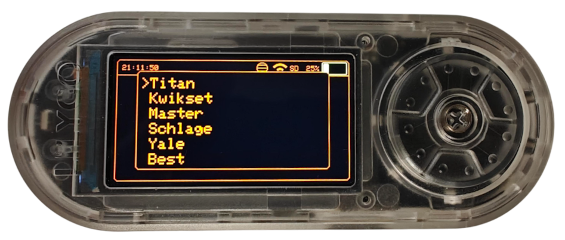
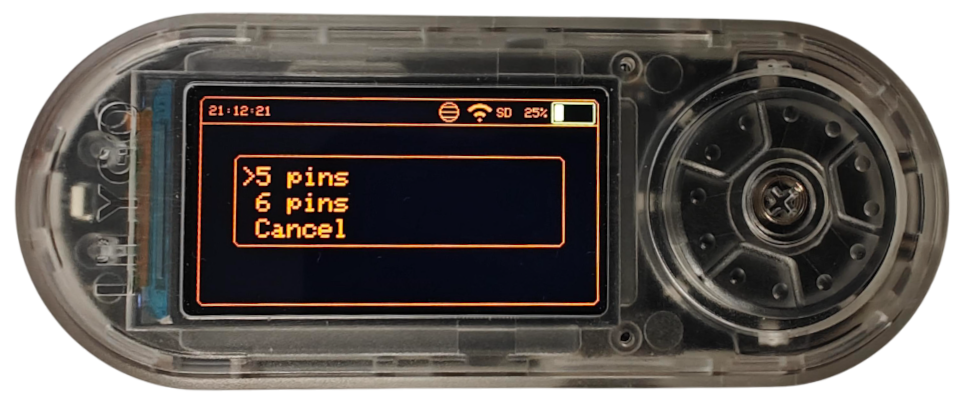
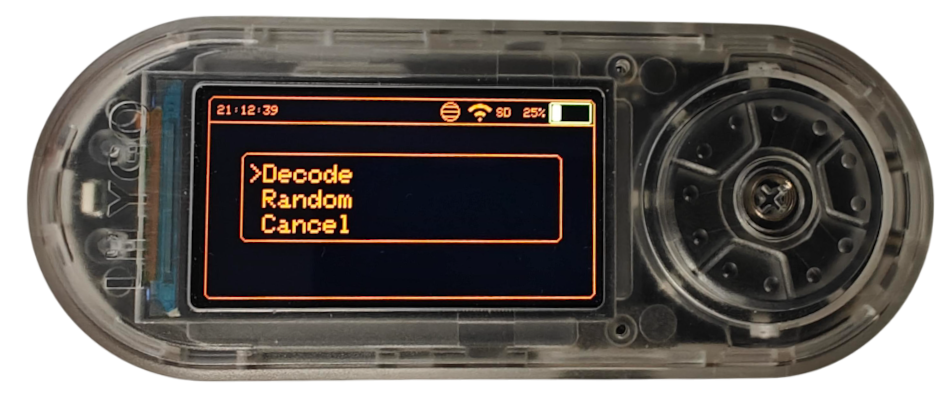
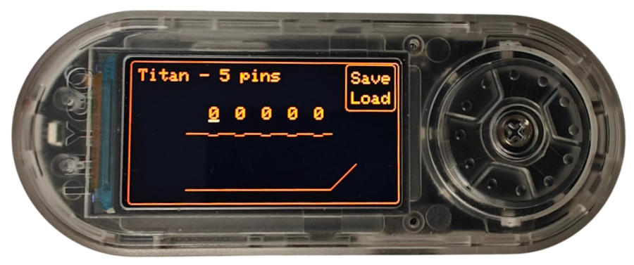
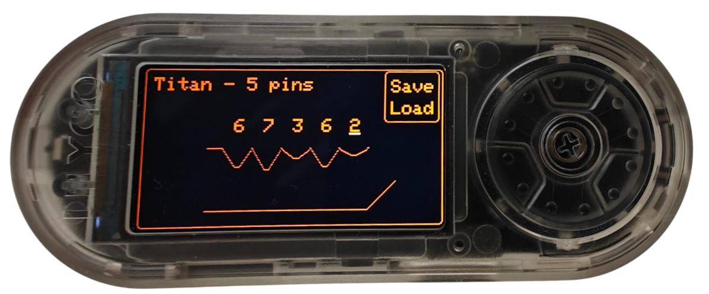
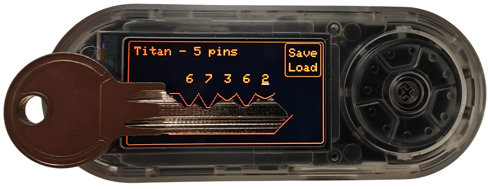
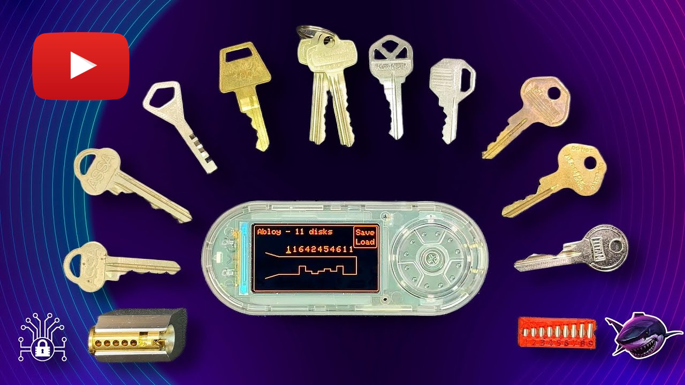
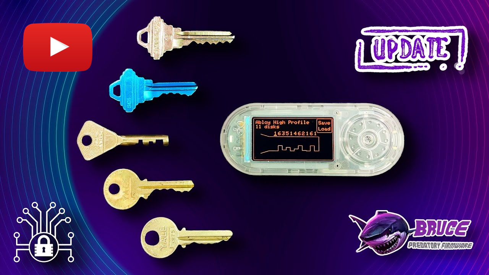

# 🔑 Key Decoding




<table style="border: none; border-collapse: collapse;">
<tr style="border: none;">
<td style="border: none;" align="center"><a href="https://www.youtube.com/watch?v=NysOI3OZwJ4" target="_blank"></a></td>
<td style="border: none;" align="center"><a href="https://www.youtube.com/watch?v=Y-vgaZMATa0" target="_blank"></a></td>
</tr>
</table>

A Bruce app for hackers, tinkerers and lock nerds.  
Decode and randomly generate key bitting patterns for a bunch of lock brands.  
Visualize the cuts, tweak the pins, and save/load your keys.  

## 📟 Supported Devices

This app is designed for Bruce Interpreter compatible devices with screen 170x320:

- [LILYGO T-Embed CC1101](https://lilygo.cc/products/t-embed-cc1101)
- [LILYGO T-Embed CC1101 Plus](https://lilygo.cc/products/t-embed-cc1101-plus)
- [Bruce PCB V2 by Smoochiees](https://bruce.computer/boards)

## 🏴‍☠️ Supported Keys

| Tested |        Brand         | Pin Options             |
|:------:|:--------------------:|:------------------------|
| ✔️     |        ASSA          | 5, 6, 7 pins            |
| ✔️     |   Abloy Classic      | 7, 9, 11 disks          |
| ✔️     | Abloy High Profile   | 7, 9, 11 disks          |
| ✔️     |      American        | 5, 6 pins               |
| ✔️     |        Best          | 7 pins                  |
| ✔️     |   Corbin Russwin     | 6 pins/CX6A             |
| ✔️     |      Kwikset         | 5 pins                  |
| ✔️     |       Master         | 4, 5 pins               |
| ✔️     |      Schlage         | 5 pins/SC1, 6 pins/SC4  |
| ✔️     |        Titan         | 5, 6 pins               |
| ✔️     |        Yale          | 5 pins                  |

## ⚡ Install

1. Drop `KeyDecoding.js` onto your Bruce device
2. Fire up the Bruce Interpreter
3. Have fun

## 🕹️ Usage

### Navigation

- **SEL (Select):** Move to next pin, or to Save/Load (in Decode mode)
- **NEXT:** Increase pin depth / Save (when "Save" is highlighted) / Load (when "Load" is highlighted)
- **PREV:** Decrease pin depth
- **ESC:** Back to main menu

### ⚙️ Workflow

1. **Pick a Brand:** Choose your target lock or load a saved key
2. **Pin Count:** Select how many pins (brand-dependent)
3. **Mode:**
    - **Random:** Get a random bitting (good for challenge keys)
    - **Decode:** Set each pin yourself (for real-world decoding)
4. **Tweak Pins:** Use NEXT/PREV to set each pin's depth
5. **Save:** SEL to "Save", then NEXT to write your key JSON
6. **Load:** SEL to "Load", then NEXT to pick a saved key

## 📂 Key File Format

Keys are saved as JSON in `/keys/`:

```json
{
  "type": "Titan",
  "outline": "5 pins",
  "pins": [ 3, 5, 2, 7, 4 ]
}
```

## Key Configuration

```js
KeyExample: {
    displayName: "Key Example",     // display name shown in menu
    isDiskDetainer: false,          // whether the key is a disk detainer type (default false)
    bladeHeight: 45,                // blade height for disk detainer keys (default 45)
    outlines: ["5 pins", "6 pins"], // number of pins
    pinSpacing: 31,                 // distance between pins (default 31)
    maxKeyCut: 9,                   // number of cuts (default 9)
    flatSpotWidth: 5,               // width of flat spot of the cut (default 5)
    cutDepthOffset: 5,              // depth offset of each cut (default 5)
    zeroCutOffset: 0,               // depth offset of zero cut (default 0)
    edgeOffsetX: 0,                 // x offset of the bottom-right diagonal (default 0)
    edgeOffsetY: 0,                 // y offset of the bottom line (default 0)
    pinsStartAtZero: false,         // whether pin numbers start at 0 or 1 (default false)
    pinNumbersOffset: 0             // x offset for pin numbers with underline (default 0)
}
```

## 🔗 Links

- [Bruce Interpreter](https://github.com/pr3y/Bruce/wiki/Interpreter)
- [Deviant Ollam: Key-and-Pin-Decoding](https://github.com/deviantollam/Key-and-Pin-Decoding)
- [Flipper Zero: KeyCopier](https://github.com/zinongli/KeyCopier)
- [LILYGO T-Embed CC1101](https://lilygo.cc/products/t-embed-cc1101)
- [ASSA Mow](https://assamow.com/specs/)


## ⭐ Contributors

- [@Phred_Phlintstoner](https://www.youtube.com/@Phred_Phlintstoner) for testing the [Bruce PCB V2 by Smoochiees](https://bruce.computer/boards)
- [@argtime](https://github.com/argtime) for PR [Add delay to KeyDecoding.js loop](https://github.com/SasPes/key-decoding/pull/2)

## ☠️ Disclaimer

For educational, CTF and red team use only.  
Don't break the law. Don't be a jerk.
