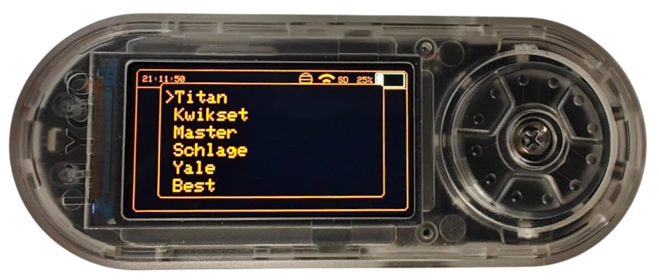
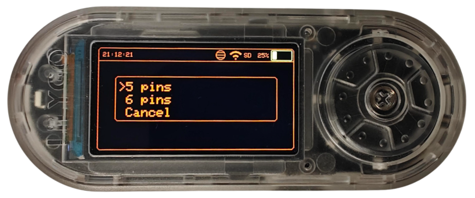
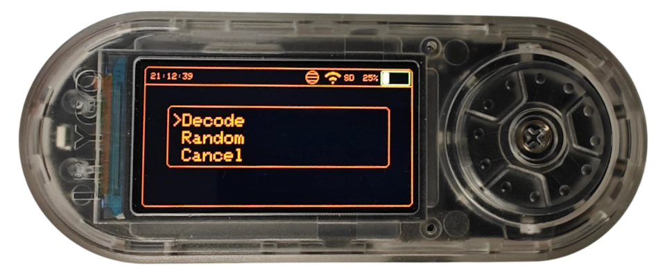
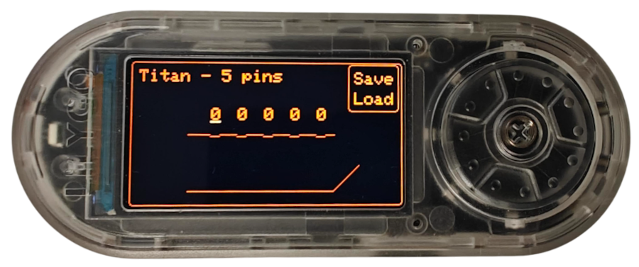
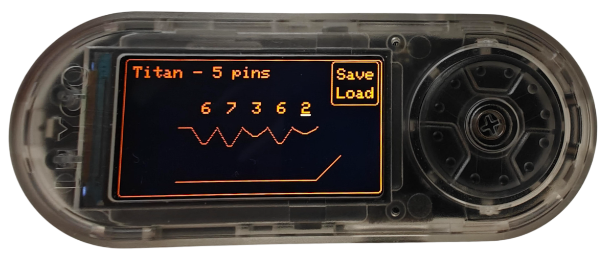
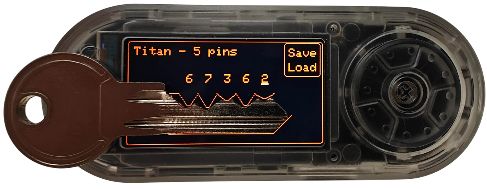
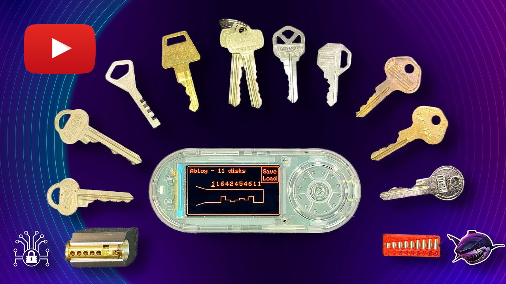
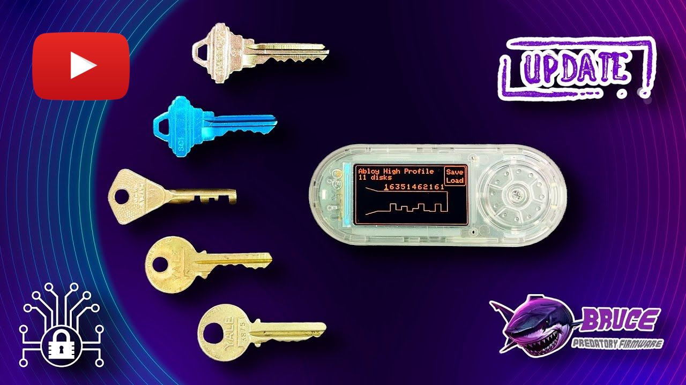
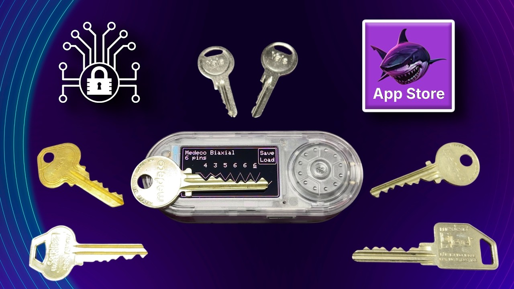

# 🔑 Key Decoding




| [](https://www.youtube.com/watch?v=NysOI3OZwJ4) | [](https://www.youtube.com/watch?v=Y-vgaZMATa0) | [](https://www.youtube.com/watch?v=BiwuVsPcDyk) |
| --- | --- | --- |

A Bruce app for hackers, tinkerers and lock nerds.  
Decode and randomly generate key bitting patterns for a bunch of lock brands.  
Visualize the cuts, tweak the pins and save/load your keys.  

## 📟 Supported Devices

This app is designed for Bruce Interpreter compatible devices with screen 170x320. Devices of other sizes will render the key incorrectly.

- [LILYGO T-Embed CC1101](https://lilygo.cc/products/t-embed-cc1101)
- [LILYGO T-Embed CC1101 Plus](https://lilygo.cc/products/t-embed-cc1101-plus)
- [Bruce PCB V2 by Smoochiees](https://bruce.computer/boards)

## 🏴‍☠️ Supported Keys

A ✔️ indicates a key outline verified against a real key. Unmarked outlines are still selectable, but they are unverified and may be less accurate.

| Brand | Key Outlines | Comments                                                    |
|:-----:|:------------|:------------------------------------------------------------|
| ASSA | ✔️ 5 pins<br>✔️ 6 pins<br>✔️ 7 pins |                                                             |
| Abloy Classic | ✔️ 7 disks<br>✔️ 9 disks<br>✔️ 11 disks |                                                             |
| Abloy High Profile | ✔️ 7 disks<br>✔️ 9 disks<br>✔️ 11 disks |                                                             |
| American | ✔️ 5 pins<br>✔️ 6 pins |                                                             |
| Arrow | ⬜ 6 pins/A<br>⬜ 7 pins/A | Shares DSD with Best (A2 small-format interchangeable core) |
| Best | ⬜ 6 pins/A2<br>✔️ 7 pins/A2 |                                                             |
| Buick | ⬜ 10 cuts/B102 | Shares DSD with Chevy B102                                  |
| Chevy | ⬜ 10 cuts/B102 |                                                             |
| Chrysler | ⬜ 8 cuts/Y159 | Shares DSD with Dodge Y159                                  |
| Corbin Russwin | ✔️ 5 pins/RU45<br>✔️ 6 pins/CX6A |                                                             |
| Dodge | ⬜ 8 cuts/Y159 |                                                             |
| Eagle | ⬜ 6 pins/A<br>⬜ 7 pins/A | Shares DSD with Best (A2 small-format interchangeable core) |
| Falcon | ⬜ 6 pins/A<br>⬜ 7 pins/A | Shares DSD with Best (A2 small-format interchangeable core) |
| Ford | ⬜ 8 cuts/H75 |                                                             |
| GMC | ⬜ 10 cuts/B102 | Shares DSD with Chevy B102                                  |
| GMS | ⬜ 6 pins/A<br>⬜ 7 pins/A | Shares DSD with Best (A2 small-format interchangeable core) |
| Jeep | ⬜ 8 cuts/Y159 | Shares DSD with Dodge Y159                                  |
| Kawasaki | ⬜ 6 cuts/KA14 |                                                             |
| KSP | ⬜ 6 pins/A<br>⬜ 7 pins/A | Shares DSD with Best (A2 small-format interchangeable core) |
| Kwikset | ✔️ 5 pins |                                                             |
| Lincoln | ⬜ 8 cuts/H75 | Shares DSD with Ford H75                                    |
| Lockwood | ⬜ 5 pins/LW4<br>⬜ 6 pins/LW5 |                                                             |
| Master | ✔️ 4 pins<br>✔️ 5 pins<br>⬜ 6 pins |                                                             |
| Medeco Biaxial | ✔️ 6 pins |                                                             |
| Mercury | ⬜ 8 cuts/H75 | Shares DSD with Ford H75                                    |
| National | ⬜ 5 pins/D8775 |                                                             |
| Oldsmobile | ⬜ 10 cuts/B102 | Shares DSD with Chevy B102                                  |
| Plymouth | ⬜ 8 cuts/Y159 | Shares DSD with Dodge Y159                                  |
| Pontiac | ⬜ 10 cuts/B102 | Shares DSD with Chevy B102                                  |
| RV | ⬜ 5 cuts |                                                             |
| Sargent | ⬜ 5 pins/LA<br>⬜ 6 pins/LA |                                                             |
| Schlage | ✔️ 5 pins/SC1<br>✔️ 6 pins/SC4 |                                                             |
| Subaru | ⬜ 9 cuts/DSD435 |                                                             |
| Suzuki | ⬜ 7 cuts/SUZ18 |                                                             |
| Titan | ✔️ 5 pins | Similar to Yale                                                |
| Weiser | ⬜ 5 pins/WR5<br>⬜ 6 pins/WR3 |                                                             |
| Weslock | ⬜ 5 pins |                                                             |
| Yale | ✔️ 5 pins/Y1<br>⬜ 6 pins/Y2 |                                                             |
| Yale Small | ✔️ 4 pins<br>✔️ 5 pins |                                                             |
| Yamaha | ⬜ 7 cuts/YM63 |                                                             |

## ⚡ Install

### Option 1: Bruce App Store
1. Open Bruce App Store via **JS Interpreter → Tools → App Store**
   - if App Store is not present, go to **Config → Install App Store**
2. Navigate to **Tools**
3. Download and install **Key Decoding**

### Option 2: Manual Install
1. Drop `KeyDecoding.js` onto your Bruce device
2. Fire up the Bruce Interpreter
3. Have fun

## 🕹️ Usage

### Navigation

- **SEL (Select):** Move to next pin, or to Save/Load (in Decode mode)
- **NEXT:** Increase pin depth / Save (when "Save" is highlighted) / Load (when "Load" is highlighted)
- **PREV:** Decrease pin depth
- **ESC:** Back to main menu

### ⚙️ Workflow

1. **Pick a Brand:** Choose your target lock or load a saved key
2. **Pin Count:** Select how many pins (brand-dependent)
3. **Mode:**
    - **Random:** Get a random bitting (good for challenge keys)
    - **Decode:** Set each pin yourself (for real-world decoding)
4. **Tweak Pins:** Use NEXT/PREV to set each pin's depth
5. **Save:** SEL to "Save", then NEXT to write your key JSON
6. **Load:** SEL to "Load", then NEXT to pick a saved key

## 📂 Key File Format

Keys are saved as JSON in `/keys/`:

```json
{
  "type": "Titan",
  "outline": "5 pins",
  "pins": [ 3, 5, 2, 7, 4 ]
}
```

## Key Configuration

```js
KeyExample: {
    displayName: "Key Example",     // display name shown in menu
    isDiskDetainer: false,          // whether the key is a disk detainer type (default false)
    bladeHeight: 45,                // blade height for disk detainer keys (default 45)
    outlines: ["5 pins", "6 pins"], // number of pins
    pinSpacing: 31,                 // distance between pins (default 31)
    maxKeyCut: 9,                   // number of cuts (default 9)
    flatSpotWidth: 5,               // width of flat spot of the cut (default 5)
    cutDepthOffset: 5,              // depth offset of each cut (default 5)
    zeroCutOffset: 0,               // depth offset of zero cut (default 0)
    edgeOffsetX: 0,                 // x offset of the bottom-right diagonal (default 0)
    edgeOffsetY: 0,                 // y offset of the bottom line (default 0)
    pinsStartAtZero: false,         // whether pin numbers start at 0 or 1 (default false)
    pinNumbersOffset: 0             // x offset for pin numbers with underline (default 0)
}
```

## 🔗 Links

- [Bruce Interpreter](https://github.com/pr3y/Bruce/wiki/Interpreter)
- [Deviant Ollam: Key-and-Pin-Decoding](https://github.com/deviantollam/Key-and-Pin-Decoding)
- [Flipper Zero: KeyCopier](https://github.com/zinongli/KeyCopier)
- [LILYGO T-Embed CC1101](https://lilygo.cc/products/t-embed-cc1101)
- [ASSA Mow](https://assamow.com/specs/)


## ⭐ Contributors

- [@Phred_Phlintstoner](https://www.youtube.com/@Phred_Phlintstoner) for testing the [Bruce PCB V2 by Smoochiees](https://bruce.computer/boards)
- [@argtime](https://github.com/argtime) for PR [Add delay to KeyDecoding.js loop](https://github.com/SasPes/key-decoding/pull/2)
- [Tyler J. Thomas](https://securityengineeringconsultants.com/) for [Key Bitting Specifications Edition 1, 2025](https://lsamichigan.org/Tech/KeyBittingSpecifications-TylerJThomas.pdf)
- [Greg Bryant](https://www.sopl.us/uploads/1/3/0/1/1301029/high_security_specs_from_greg_bryant.pdf) for sidewinder key bitting
- [@ellygaytor](https://github.com/ellygaytor) for DSD aliasing, icons, and help menu
- <a href="https://www.flaticon.com/free-icons/digital-key" title="digital key icons">Digital key icons created by Fliqqer - Flaticon</a>

## ☠️ Disclaimer

For educational, CTF and red team use only.  
Don't break the law. Don't be a jerk.  
Accuracy of non-verified options may be poor.